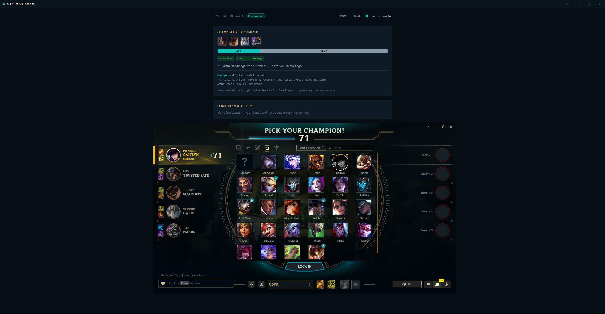
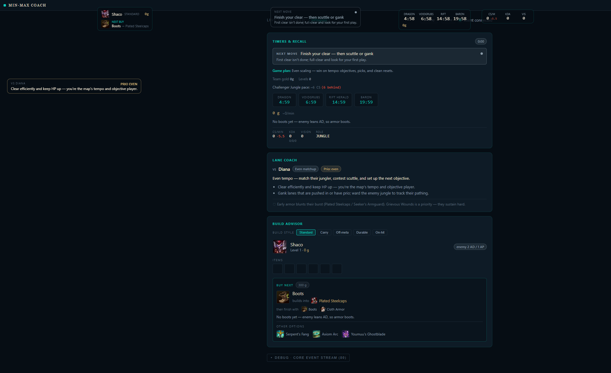
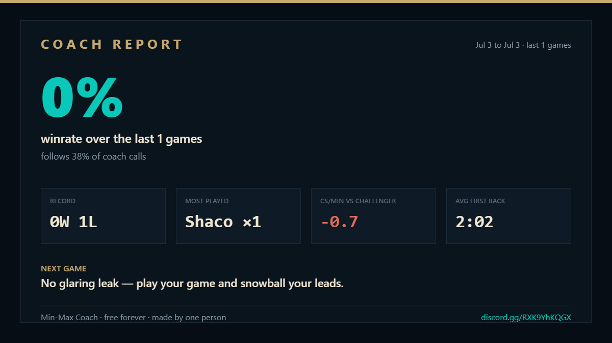

# Min-Max Coach

**A free, lightweight League of Legends coach that runs alongside your game — and does none of the things Riot bans accounts for.**

Real-time draft help, lane-matchup coaching, build paths, objective timers, and a post-game "climb plan" — in a ~3 MB app with **no account, no ads, no API key, and nothing that ever leaves your PC.**

### [⬇ Download the latest version](../../releases/latest)

**[💬 Join the Discord](https://discord.gg/RXK9YhKQGX)** — questions, feedback, and update news. The app updates itself silently, so what you install today keeps getting better every week.

**The one-game challenge:** install it and play a single game. 3 MB, no account, nothing to configure — it connects by itself. If it doesn't make one call you hadn't thought of, uninstall it and you've lost four minutes. Would be suprised if you uninstall it, especially as its only getting better.

## See it

**Champ select** — runes, summoners, starting items, and your game plan, the moment you hover a champion:

**In game** — the live dashboard and overlay: your next move, objective timers, lane coaching, and the exact next buy:

**After the game** — the Coach Report, a shareable recap that even tracks how often you follow the coach (it will absolutely call you out):

## Why I built this

I love this game, but I got tired of the tools around it. The best coaching info is locked behind monthly subscriptions. The popular overlays are heavy, ad-stuffed, and want you to create an account so they can harvest your data. And a few of them quietly put your account at risk by reading things they shouldn't.

On top of that, modern apps have gotten absurd — hundreds of megabytes, slow to open, and so resource-hungry that if you don't have a strong PC you can't even run them without your game stuttering. For a League tool that's backwards: the last thing you want is an overlay eating the frames you need to play. So I built this in **Rust** — the whole app is about 3 MB, it opens instantly, and it uses so little memory and CPU you'll forget it's running. It runs fine on a potato.

I also believe climbing isn't a secret. I was able to get to Diamond from just basic fundamentals and decisions. A Challenger player isn't seeing hidden information — they're reading the **same public information you already have**, and making the right call a half-second sooner. *Recall on this wave. Group for this drake. Build this item into their comp.* That's learnable.

So I built the coach I always wanted: one that reads the public game state alongside you and tells you the next right move, in the moment — and gives it away **free, forever**, with nothing sketchy under the hood. No account. No ads. No data leaving your PC. Nothing that can get you banned.

If it helps even a few people climb, it was worth building.

## What makes it different

| | **Min-Max Coach** | Typical overlays |
|---|---|---|
| **Price** | Free — *every* feature | Best features behind a subscription |
| **Account** | None — just run it | Sign-up + login required |
| **Your data** | Stays on your PC | Often uploaded / harvested |
| **Footprint** | ~3 MB · won't touch your FPS | Hundreds of MB · can tank your frames |
| **Safety** | No automation, no memory reading, no hidden info | Some risk your account |
| **What it gives** | Real-time **decisions**, not just stats | Mostly stat dashboards |

## What it does

- **Champ select** — team-comp read, counter picks, ban suggestions, and a rune/summoner tip for your pick.
- **In game (overlay)** — your next macro move, lane matchup + who has priority, the exact next item to buy, and dragon/baron/herald/grub timers, all on a movable overlay.
- **Between games** — performance trends, a focused **climb plan**, and progress toward your rank goal.

## Why it's safe

Min-Max Coach does **none of the things Riot bans accounts for**. It reads only official, public Riot interfaces (the in-game Live Client Data API and the local League Client API) plus public data. It does **not**:

- read game memory or inject code,
- automate your client (it only ever *recommends* — never auto-accepts, picks, or dodges),
- surface any hidden opponent information (no enemy cooldowns, positions, or summoner timers),
- require a Riot API key, an account, or any login.

Everything runs locally on your machine. See **[PRIVACY.md](PRIVACY.md)**.

## Install

1. Download the `.exe` from the **[latest release](../../releases/latest)**.
2. Run it. Windows may show a SmartScreen warning (the app isn't code-signed yet) — click **More info → Run anyway**.
3. Launch League of Legends. Min-Max Coach connects automatically.

**Requirements:** Windows 10/11.

## Is the download safe? Verify it yourself

Because the app is new and not yet code-signed, Windows SmartScreen shows an "unrecognized publisher" warning — that means *unrecognized*, not *unsafe*. New indie apps almost always trip it. Don't just take my word for it, though:

- **VirusTotal** (scanned by ~70 antivirus engines): the v0.1.0 installer **[scanned clean](https://www.virustotal.com/gui/file/eca06e997fd2b1ec1b99e6c4535f32521b130953959c269c3482bf569ba280aa)** on every major engine — Microsoft, Kaspersky, Bitdefender, ESET, Sophos, CrowdStrike, Malwarebytes, and more. (One minor engine, SecureAge, flags unsigned apps by default — a known false positive.) You can drop any release's installer on virustotal.com yourself; it takes a minute.
- **Confirm the file is the real one** — the v0.1.6 installer's SHA-256 is:
  `BFDD19C13572596A097F1FB4863C324C2E34E9D938E8DDD87A404D24F7FD5F5E`
  Check it in PowerShell: `Get-FileHash .\Min-Max-Coach-0.1.6-setup.exe`
- **Updates are cryptographically signed** — the app only installs updates signed with my key, so nobody can slip you a tampered build through the updater.
- **What it does with your data:** nothing leaves your PC — no account, no telemetry, no uploads. See **[PRIVACY.md](PRIVACY.md)**.

The source is closed (it's my own work), so there's some trust involved — I won't pretend otherwise. Code-signing, which removes the warning entirely, is on the list as the project grows.

## Free, forever

This is and always will be free — every feature, no paywall. If it helps you climb and you'd like to support development, donations are welcome (link coming soon), but they're never required.

## All I ask is your feedback

I'm trying to make this the best League coach out there, and the only thing I want in return is your help making it better. If you have a few seconds, **tell me what you liked, what's missing, or what broke** — that's exactly what shapes the next version.

→ **[Join the Discord](https://discord.gg/RXK9YhKQGX)** and tell me directly, or **[open an issue](../../issues)** with a bug or an idea. Anything helps, and it's genuinely appreciated.

Min-Max Coach is not endorsed by or affiliated with Riot Games. "League of Legends" and "Riot Games" are trademarks of Riot Games, Inc. © 2026. Licensed under [EULA.txt](EULA.txt).
